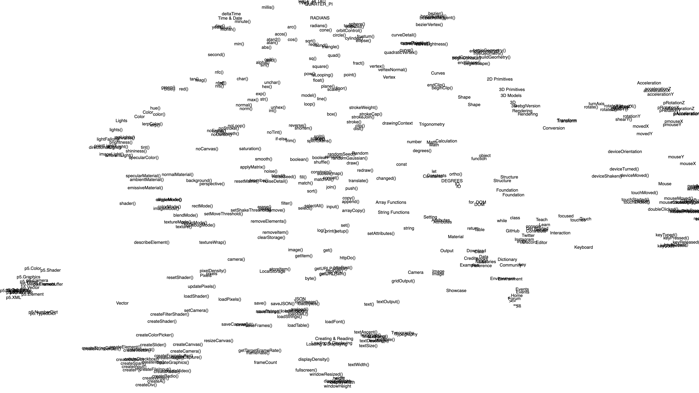

# Saving Embeddings to JSON file

## Overview

This is an example Node.js application processes a text corpus, generates embeddings for "chunks", and saves the embeddings to a local file. The embeddings can be used in another application (like a [Retrieval Augmentated Generation system](https://github.com/Programming-from-A-to-Z/Example-RAG-Replicate) or [2D/3D clustering demonstration using UMAP dimensionality reduction](https://editor.p5js.org/a2zitp/sketches/p63QTp0Sd))

There are two main scripts in this project:

- `embeddings-replicate.js``: Generates embeddings using the Llama model on Replicate.
- `embeddings-transformers.js``: Generates embeddings using the bge-small model with transformers.js.

Both scripts output the embeddings to `embeddings.json`.

### Replicate with Llama model

- `.env`: API token for Replicate
- [Using open-source models for faster and cheaper text embeddings](https://replicate.com/blog/run-bge-embedding-models)

### Using transformers.js with bge-small model

- Uses the [transformers.js package](https://www.npmjs.com/package/@xenova/transformers) and [bge-small model](https://huggingface.co/ggrn/bge-small-en) for embeddings generation.
- `embeddings-transformers.js`: Script to process a text file and generate embeddings using the bge-small model.



## References

## How-To

1. Install Dependencies

```sh
npm install
```

### For Replicate (embeddings-replicate.js)

2. Set up the `.env` file with your Replicate API token:

```env
REPLICATE_API_TOKEN=your_api_token_here
```

3. Generate the `embeddings.json` file.

You'll need to hard-code a text filename and adjust how the text is split up depending on the format of your data.

```js
const raw = fs.readFileSync('text-corpus.txt', 'utf-8');
let chunks = raw.split(/\n+/);
```

Then:

```sh
node embeddings-replicate.js
```

### For transformers.js (embeddings-transformers.js)

2. Generate the `embeddings.json` file. Adjust the text filename and splitting method as needed:

```js
const raw = fs.readFileSync('text-corpus.txt', 'utf-8');
let chunks = raw.split(/\n+/);
```

```sh
node embeddings-transformers.js
```
